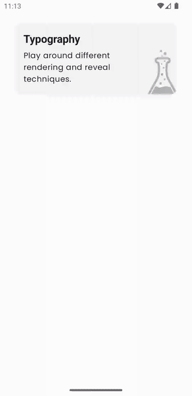
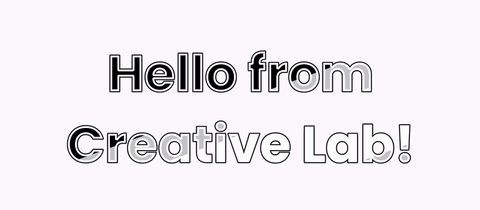
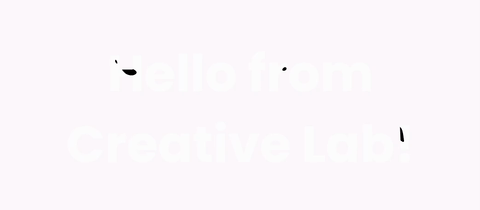
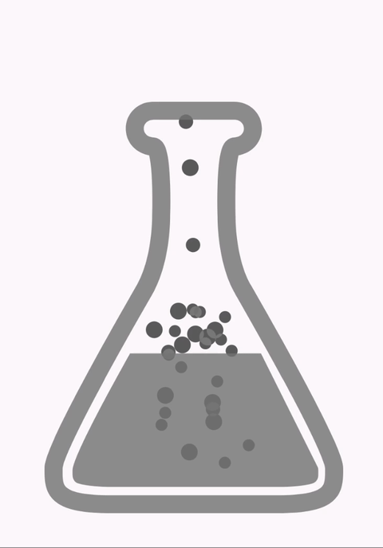

# creative-lab
Welcome to creative-lab, a fascinating collection of experiments exploring the realm of Creative Coding and Jetpack Compose. Here, I delve into the depths of creativity, continuously expanding and evolving the project. If you have any questions or need assistance, feel free to check out the code, or reach out to me via direct message.

# Sample Showcase
To give you a glimpse of the magic within creative-lab, here are a couple of captivating samples:

## 1. Animated stroked typography
Dynamic strokes bring typography to life, fusing design and animation.

 

## 2. Noise Reveal
Text dynamically emerges and vanishes with controlled revelation using a noise function.

 

## 3. Star Wars Scrolling Text
Immerse yourself in the nostalgia of classic Star Wars movies with this remarkable recreation of the iconic scrolling text effect, flawlessly brought to life using Jetpack Compose.

 

## 4. Chemical Beaker
Bubbles rise from within, ascending through the neck, escaping into the outer world.

 

# Getting Started
To experience the wonders of creative-lab firsthand, follow these simple steps:

Clone this repository: git clone https://github.com/manuel-martos/creative-lab.git
Open the project in your preferred development environment.
Explore the various experiments available, discover their inner workings, and unlock your creativity.

# Contribution
creative-lab is an open invitation for collaboration. If you have any suggestions, ideas, or improvements to share, feel free to submit a pull request. Let's push the boundaries of creative coding together!

# License
This project is licensed under the MIT License, allowing you to freely explore, experiment, and build upon the foundation laid out in creative-lab.

Embark on a journey of creativity and innovation with creative-lab. Let your imagination soar, and don't forget to star the repository if you find it inspiring!

Connect with me on social media for more updates and exciting developments. Together, let's redefine the world of Creative Coding! ✨🎨🚀
